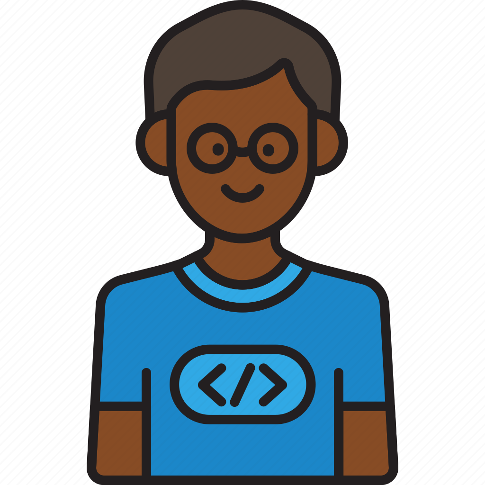

<!--Banner-->

<!--Night Owl image-->

  

<!--Header Name-->
# ɪ'ᴍ Essi Junior! 
*(Developer / Programmer) and software engineer*
  

<!--Start Intro-->               

I am a Full Stack Developer with a huge love for FastAPI, React.js, Node.js, React-native, Mongo.db and software project management. 

- ✨ As long as i have hands, i can code anything.
- 🌱 I like challenges
- ❤ I really love programming
- 💻 Visit my [Portfolio](https://essijunior.com) for more details about my skills.
<!--End Intro-->

  

<h3 align="center">
        <samp> Hey There!... I am
                <b> Essi Junior  </b>
        </samp>
</h3>

 
  
   

 

<h2 align="center"> Skills</h2>

        

<h2 align="center"> Github Stats </h2>

    

    

    
    

    

     

---

